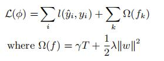
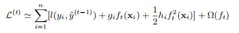
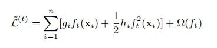
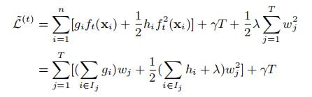
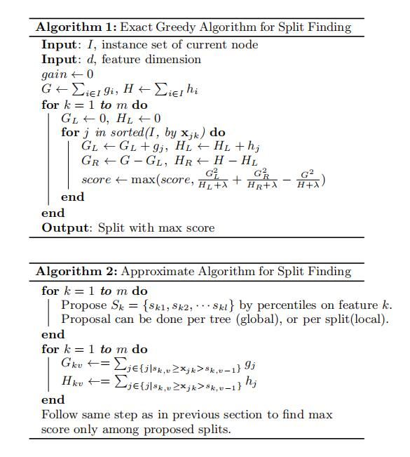
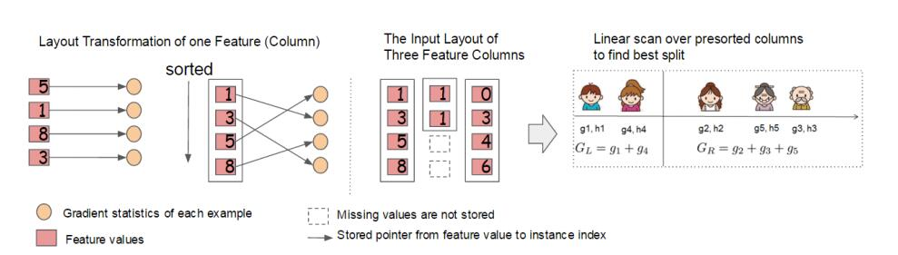

# XGBoost学习报告

## 说明

我阅读了陈天奇所写的**XGBoost: A Scalable Tree Boosting System**文章，结合一些其他资料进行了整理

arxiv文章地址https://arxiv.org/pdf/1603.02754.pdf

## Abstract

首先我们来看Abstract

> Tree boosting is a highly effective and widely used machine learning method. In this paper, we describe a scalable end-to-end tree boosting system called XGBoost, which is used widely by data scientists to achieve state-of-the-art results on many machine learning challenges. We propose a novel sparsity-aware algorithm for sparse data and weighted quantile sketch for approximate tree learning. More importantly, we provide insights on cache access patterns, data compres sion and sharding to build a scalable tree boosting system.By combining these insights, XGBoost scales beyond billions of examples using far fewer resources than existing systems.

大概意思就是XGBoost能用更小的训练集训练出更好的模型

## 1.Introduction

读完Introduction，可以了解到XGB之所以性能更好，是因为在以下几个方面做了优化

1. 设计和构建高度可扩展的端到端提升树系统。 

2. 提出了一个理论上合理的加权分位数略图。 这个东西就是推荐分割点的时候用，能不用遍历所有的点，只用部分点就行，近似地表示，省时间。

3. 引入了一种新颖的稀疏感知算法用于并行树学习。 令缺失值有默认方向。

4. 提出了一个有效的用于核外树形学习的缓存感知块结构。 用缓存加速寻找排序后被打乱的索引的列数据的过程。
   

## 3.TREE BOOSTING IN A NUTSHELL

梯度提升树的框架构建

**Regularized Learning Objective**

XBG的损失函数为

**Gradient Tree Boosting**

对经验误差进行二阶泰勒展开作为损失函数

忽略常数项后为

最后把正则项展开，得到

正则项里的T是叶子节点的个数，gamma是这一项的系数，lambda是所有叶子节点的权值的l2正则之和的系数,当正则项系数为0时，整体的目标就退化为了GBDT

**Shrinkage and Column Subsampling**

就是相当于学习速率和对于列的采样操作,调低eta能减少个体的影响，给后续的模型更多学习空间

描述了传统的方法，即无差别地遍历所有的分割点，算法如Algorithm1

当数据量过大，传统算法就不好用了，因为要遍历每个分割点，甚至内存都放不下，所以，xgb提出了额外一种近似算法能加快运行时间，算法如Algorithm2

## 3.SPLIT FINDING ALGORITHMS

这个算法根据特征的分布情况，然后做个proposal，然后这一列的分割点就从这几个proposed candidate points里选，能大大提高效率。这里有两种proposal的方式，一种是global的，一种是local的，global的是在建树之前就做proposal然后之后每次分割都要更新一下proposal，local的方法是在每次split之后更新proposal。通常发现local的方法需要更少的candidate，而global的方法在有足够的candidate的时候效果跟local差不多。**一般只在超大型数据中用到**

算法在研究特征分布然后做proposal的时候，用到了加权分位数略图（weighted quantile sketch），原文说不加权的分位数略图有不少了，但是支持加权的以前没人做，我对这个东西不太了解，百度了一下相关的关键词：

构造略图（sketching）是指使用随机映射（Random projections）将数据流投射在一个小的存储空间内作为整个数据流的概要，这个小空间存储的概要数据称为略图，可用于近似回答特定的查询。不同的略图可用于对数据流的不同Lp范数的估算，进而这些Lp范数可用于回答其它类型的查询。如L0范数可用于估算数据流的不同值(distinct count)；L1范数可用于计算分位数（quantile）和频繁项（frequent items）；L2范数可用于估算自连接的长度等等。

另外，在分割的时候，这个系统还能感知稀疏值，我们给每个树的结点都加了一个默认方向，当一个值是缺失值时，我们就把他分类到默认方向，每个分支有两个选择，具体应该选哪个？这里提出一个算法，枚举向左和向右的情况，哪个gain大选哪个：

## 4.**SYSTEM DESIGN**

**Column Block for Parallel Learning**

> The most time consuming part of tree learning is to get the data into sorted order. In order to reduce the cost of sorting, we propose to store the data in in-memory units, which we called *block*. Data in each block is stored in the compressed column (CSC) format, with each column sorted by the corresponding feature value. This input data layout only needs to be computed once before training, and can be reused in later iterations.

这里主要介绍了block的设计，原来的树在对数据进行排序分类的时候就花费了大量时间，所以设计了block，用来压缩存储数据。

paper中把所有列数据进行预先排序，以压缩形式分别存到block里，不同的block可以分布式存储，甚至存到硬盘里。在特征选择的时候，可以并行的处理这些列数据，XGB就是在这实现的并行化，用多线程来实现加速。同时这里作者还用cache加了一个底层优化（就是sorted之后的部分）：

## 5.**RELATED WORKS**

介绍了相关工作的一些细节

## 6.**END TO END EVALUATIONS**

介绍了XGB的优秀效果