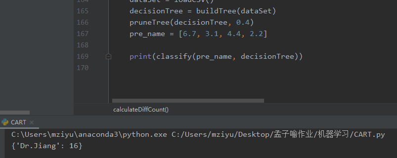
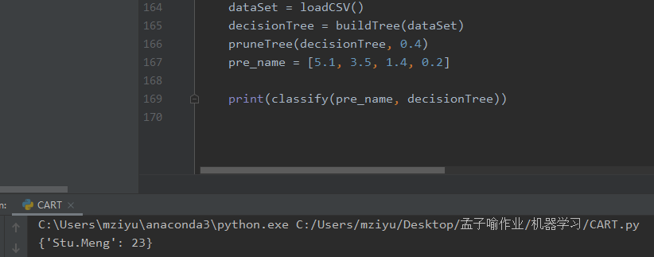

## 5.决策树

**运行效果：**

我建立了一个数据集，里边有两类Stu.Meng和Dr.Jiang来代指我和老师，前边的feat1\2\3\4是区分我们两个人的变量（随便从网上找的数据集，略微改了改，原来是根据四个变量区分花的种类的，只用了数据集，代码是自己写的），通过这四个变量区分我和老师,为了方便区分这两类，我把两个人的feat4调的差距大了些，一个是0\~0.5，一个是1\~2.5，这样我们（人，不是程序）看到的时候就知道是不是分错了

示例





调节阈值后基本都能分类正确

完整代码见CART.py

写这个挺有意思的，因为之前只是听说，但是自己手写一遍真真让人学到很多，比如之前的分离点的计算，对算法的理解更透彻了

### 5.1构建树类

因为对构建树的方式不熟悉，所以查阅了比较多的资料，以下这种标记`TrueBranch`和`FalseBranch`的方式是比较容易理解的，所以使用此种方式

```python
class CARTTree:
    def __init__(self, value=None, trueBranch=None, falseBranch=None, results=None, col=-1, summary=None, data=None):
        self.value = value
        self.trueBranch = trueBranch
        self.falseBranch = falseBranch
        self.results = results
        self.col = col
        self.summary = summary
        self.data = data

    def __str__(self):
        print(self.col, self.value)
        print(self.results)
        print(self.summary)
        return ""
```

### 5.2基尼指数的计算

计算基尼指数，此处按课本公式来即可，比较简单

```python
def gini(dataset):
    # 计算基尼指数

    data_num = len(dataset)
    # 以下部分用于统计每个类别出现的个数，并组成一个字典，存在result中
    results = {}
    for data in dataset:
        # data[-1] means dataType
        if data[-1] not in results:
            results.setdefault(data[-1], 1)
        else:
            results[data[-1]] += 1

    gini_result = 0
    gini_result = float(gini_result)
    for i in results:
        gini_result += (results[i] / data_num) * (results[i] / data_num)
    return 1 - gini_result
```

### 5.3建树

建立CART二叉树，即针对不同的切分点，计算整体的基尼指数，取能使基尼指数最小的点做父节点建立CART决策树

```python
def buildTree(rows):
    # 递归建立决策树， 当gain=0，时停止回归
    # build decision tree bu recursive function
    # stop recursive function when gain = 0
    # return tree
    currentGain = gini(rows)
    column_lenght = len(rows[0])
    rows_length = len(rows)

    best_gain = 0.0
    best_value = None
    best_set = None

    # choose the best gain
    for col in range(column_lenght - 1):
        col_value_set = set([x[col] for x in rows])
        for value in col_value_set:
            list1, list2 = chooseSplitData(rows, value, col)
            p = len(list1) / rows_length
            gain = currentGain - p * gini(list1) - (1 - p) * gini(list2)
            if gain > best_gain:
                best_gain = gain
                best_value = (col, value)
                best_set = (list1, list2)
    dcY = {'impurity': '%.3f' % currentGain, 'sample': '%d' % rows_length}
    #
    # stop or not stop

    if best_gain > 0:
        trueBranch = buildTree(best_set[0])
        falseBranch = buildTree(best_set[1])
        return CARTTree(col=best_value[0], value=best_value[1], trueBranch=trueBranch, falseBranch=falseBranch, summary=dcY)
    else:
        return CARTTree(results=calculateDiffCount(rows), summary=dcY, data=rows)
```

### 5.4分离点的计算

根据相对分离点大小将实例点分到左右两个子树中

```python
def chooseSplitData(dataset, value, column):
    lefttree = []
    righttree = []

    if isinstance(value, int) or isinstance(value, float):
        for row in dataset:
            if row[column] >= value:
                lefttree.append(row)
            else:
                righttree.append(row)
    else:
        for row in dataset:
            if row[column] == value:
                lefttree.append(row)
            else:
                righttree.append(row)
    return lefttree, righttree
```

### 5.5剪枝

计算是否取得损失函数最小，否则进行剪枝

```python
def pruneTree(tree, miniGain):
    if tree.trueBranch.results == None:
        pruneTree(tree.trueBranch, miniGain)
    if tree.falseBranch.results == None:
        pruneTree(tree.falseBranch, miniGain)

    if tree.trueBranch.results != None and tree.falseBranch.results != None:
        len1 = len(tree.trueBranch.data)
        len2 = len(tree.falseBranch.data)
        len3 = len(tree.trueBranch.data + tree.falseBranch.data)

        p = float(len1) / (len1 + len2)

        gain = gini(tree.trueBranch.data + tree.falseBranch.data) - p * gini(tree.trueBranch.data) - (1 - p) * gini(tree.falseBranch.data)

        if gain < miniGain:
            tree.data = tree.trueBranch.data + tree.falseBranch.data
            tree.results = calculateDiffCount(tree.data)
            tree.trueBranch = None
            tree.falseBranch = None           
```

### 5.6分类预测

```python
def classify(data, tree):
    if tree.results != None:
        return tree.results
    else:
        branch = None
        v = data[tree.col]
        if isinstance(v, int) or isinstance(v, float):
            if v >= tree.value:
                branch = tree.trueBranch
            else:
                branch = tree.falseBranch
        else:
            if v == tree.value:
                branch = tree.trueBranch
            else:
                branch = tree.falseBranch
        return classify(data, branch)
```

