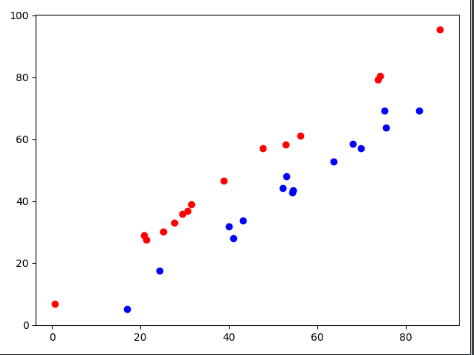
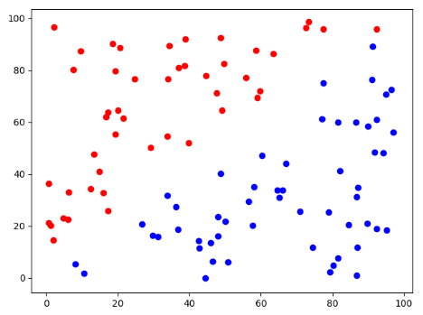
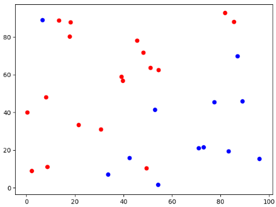
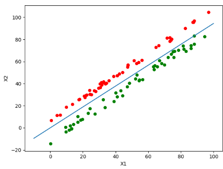
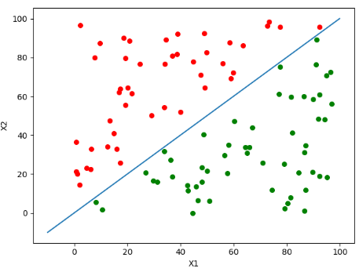
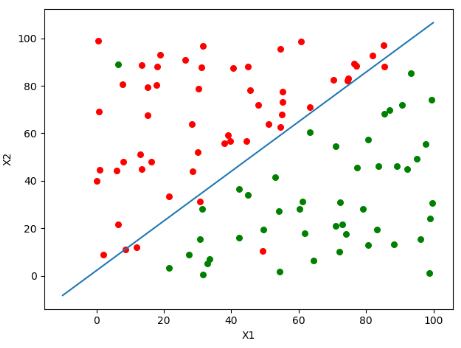

## 1.牛顿法&2.拟牛顿法


## 3.逻辑斯蒂回归

#### 3.1数据集生成

为了逐步检测性能，我写了三种不同划分难度的数据集

**1.正负数据点严格分布在分割线两端临近处**



```python
"""
* @author   孟子喻
* @time     2021.4.16
* @file     make_dataset.py
"""
import numpy as np
import matplotlib.pyplot as plt
import csv

def make_dataset(data_size,  weight, bias):
    """
    设置一条线划两个区间，直线以上的点为正类，以下的点为负类
    """
    x = 100*np.random.rand(data_size)
    dataset = []
    num = 0
    for item in x:
        # 设一半正类一半负类
        if (num % 2) == 0:
            y = item * weight + bias - 10*np.random.rand() - 5
            dataset.append([item, y, 0])
        else:
            y = item * weight + bias + 5*np.random.rand() + 5
            dataset.append([item, y, 1])
        num += 1
    show_dataset(dataset)
    resize_dataset = []
    for data in dataset:
        resize_dataset.append([[data[0], data[1], 1], data[2]]) # 把bias并入weight

    with open("data_1.csv", "w")as f:
        writer = csv.writer(f, delimiter=" ")
        writer.writerows(dataset)

    return resize_dataset

def show_dataset(dataset):
    positive_x = []
    positive_y = []
    negative_x = []
    negative_y = []
    for item in dataset:
        if item[2] == 1:
            positive_x.append(item[0])
            positive_y.append(item[1])
        if item[2] == 0:
            negative_x.append(item[0])
            negative_y.append(item[1])
        plt.scatter(positive_x, positive_y, color="r")
        plt.scatter(negative_x, negative_y, color="b")
        plt.show()

if __name__ == "__main__":
    data_size = 100
    weight, bias = 1, 100
    dataset = make_dataset(data_size, weight, bias)
```

**2.正负数据点离散分布在整个平面内**



代码和上面的类似，只不过生成代码的方式改为先随机生成点坐标，然后划分一条曲线，将两端的点分别打上不同标签

```python
def make_dataset_B(data_size, weight, bias):
    """
    设置一条线划两个区间，直线以上的点为正类，以下的点为负类
    """
    # 人为设置了一条曲线
    dataset = []
    while data_size > 0:
        data = []
        x1 = 100*np.random.rand()
        x2 = 100*np.random.rand()
        data.append(x1)
        data.append(x2)
        if x1*weight+bias<x2:
            data.append(1)
        else:
            data.append(0)
        dataset.append(list(data))
        data_size -= 1

    show_dataset(dataset)

    with open("data_B.csv", "w")as f:
        writer = csv.writer(f, delimiter=" ")
        writer.writerows(dataset)

    return dataset
```

**3.正负数据点离散分布在整个平面内，且有部分错误分类**

在2中随便取一正一负两个实例点取反即可



```python
def make_dataset_C(data_size, weight, bias):
    """
    设置一条线划两个区间，直线以上的点为正类，以下的点为负类
    """
    dataset = []
    while data_size > 0:
        data = []
        x1 = 100*np.random.rand()
        x2 = 100*np.random.rand()
        data.append(x1)
        data.append(x2)
        if x1*weight+bias<x2:
            data.append(1)
        else:
            data.append(0)
        dataset.append(list(data))
        data_size -= 1

    for data in dataset:
        if data[2] == 0:
            data[2] = 1
            break
    for data in dataset:
        if data[2] == 1:
            data[2] = 0
            break

    show_dataset(dataset)


    with open("data_C.csv", "w")as f:
        writer = csv.writer(f, delimiter=" ")
        writer.writerows(dataset)

    return dataset
```

接下来是用LogisticRegression方法的识别代码

先放三种情况的识别效果







可见对三种情况的分类效果都很好，第三种情况的存在个别错误分类情况（除故意标错的点外），调大epoch后便能消除误差

**以下为LogisticRegression实现算法**

```python
"""
* @author   孟子喻
* @time     2021.4.19
* @file     Logistic_Regression.py
*           make_dataset.py
"""
import numpy as np
import matplotlib.pyplot as plt
import csv
# 此处用优化后的sigmoid，不然会报overflow的warning（其实不要紧）
def sigmoid(x):
    if x>0:
        return 1 / (1 + np.exp(-x))
    else:
        return np.exp(x) / (1 + np.exp(x))

# 显示回归直线
def plotRegressionResult(weights):
    dataset, labels = read_data()
    n = np.shape(dataset)[0]
    x1_positive = []
    y1_positive = []
    x2_negative = []
    y2_negative = []
    for i in range(n):
        if labels[i] == 1:
            x1_positive.append(dataset[i][1])
            y1_positive.append(dataset[i][2])
        else:
            x2_negative.append(dataset[i][1])
            y2_negative.append(dataset[i][2])
    fig = plt.figure()
    ax = fig.add_subplot(111)
    ax.scatter(x1_positive, y1_positive, s=30, c='red')
    ax.scatter(x2_negative, y2_negative, s=30, c='green')
    x = np.arange(-10, 100, 0.1)
    y = (-weights[0, 0] - weights[1, 0] * x) / weights[2, 0]
    ax.plot(x, y)
    plt.xlabel('X1')
    plt.ylabel('X2')
    plt.show()

# 该函数用于读取x1、x1和label（即正负类）
def read_data():
    dataset = np.loadtxt('data_C.csv')
    # print(data)  # 测试查看data形状
    data = dataset[:, 0:-1]  # 表示读取所有数据的对应行
    labels = dataset[:, -1]  # 读标签
    data = np.insert(data, 0, 1, axis=1)  # 添加1是为了把w*x+b简化为w*x
    print(data)
    return data, labels


def SGD(dataset, labels, epoch=1000):
    data_size, x_dim = np.shape(dataset)
    print(data_size, x_dim)
    weights = np.ones(x_dim)  # 把weight初始化一下
    for j in range(epoch):
        dataIndex = list(range(data_size))
        for i in range(data_size):
            lr = 4 / (1 + i + j) + 1
            # 随机取一个错误实例点
            randIndex = int(np.random.uniform(0, len(dataIndex)))

            h = sigmoid(sum(dataset[i] * weights))
            error = labels[i] - h
            weights = weights + lr * error * dataset[i]
            del(dataIndex[randIndex])
    return weights


if __name__ == '__main__':
    dataset, labels = read_data()
    r = SGD(dataset, labels)
    print(r)
    r = np.mat(r).transpose()
    plotRegressionResult(r)
```


