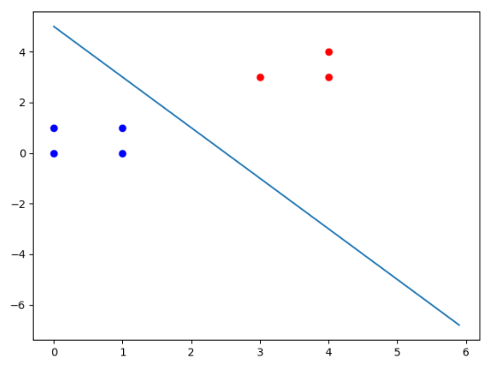
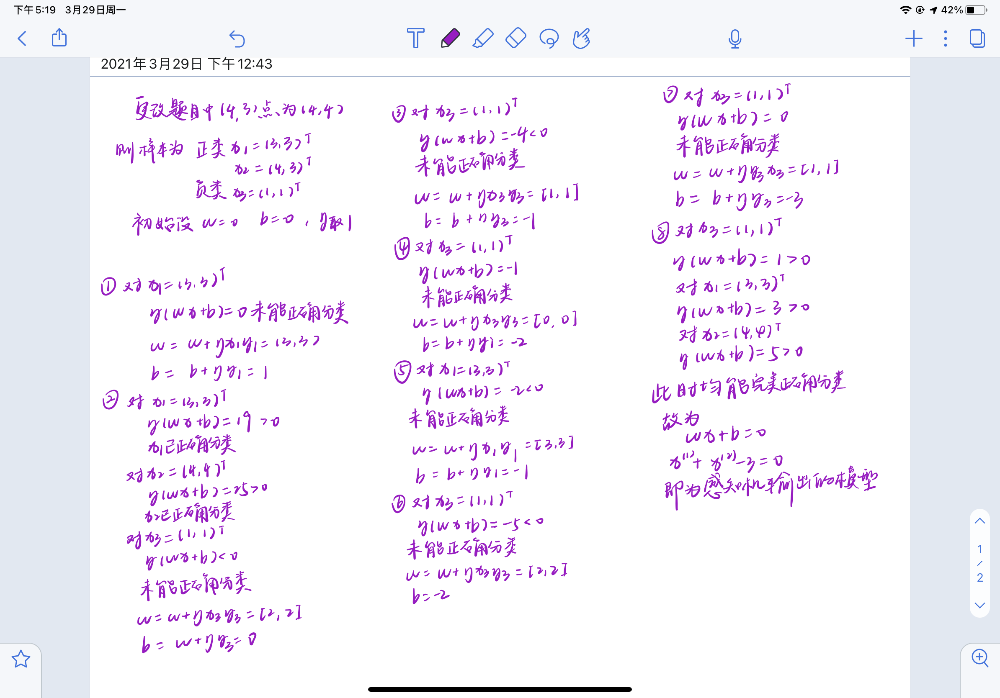

### 1.验证感知机为什么不能表示异或

本部分为练习LaTeX所以没用手写，而是敲的公式

先列异或的逻辑表

| a    | b    | XOR  |
| ---- | ---- | ---- |
| 0    | 0    | 0    |
| 0    | 1    | 1    |
| 1    | 0    | 1    |
| 1    | 1    | 0    |

课本给出的感知机模型为

$f(x)=sign(w \cdot x + b)$

我们使用感知机原始形式尝试证明（反证），与上面的a和b对应的向量的两个维度为$x1$和$x2$

1. $x1=0$并且$x2=0$时，令$f(x)=0$，需要**$b<0$**
2. $x1=0$并且$x2=1$时，令$f(x)=1$，需要，$f \cdot (w \cdot x+b)>0 $，注意这里$w$是列向量，$w1*0+w2*1+b>0$，也就是$w2<b<0$
3. $x1=1$并且$x2=0$时，和上面一样，推出$w1<b<0$
4. $x1=1$并且$x2=1$时，令$f(x)=0$，需要$（w1+w2+b）>0$

**4的条件和1、2、3的条件相冲突**，所以不可能存在这样的超平面

综上证得，感知机不能实现异或

### 2.解感知机模型

这题我用手算和python代码分别实现了一次，先上用python的

```python
"""
    数据组织形式：
    每个实例点占一行，最后一个为label，其余为输入值，中间用空格隔开
"""
import numpy as np
import matplotlib.pyplot as plt

# 从data.txt中加载数据
data = []
label = []
file = open('Data.txt')
for line in file:
    line = line.split(' ')
    for i in range(len(line)):
        line[i] = float(line[i])
    data.append(line[0: len(line)-1])
    label.append(int(line[-1]))
file.close()
data = np.array(data)
label = np.array(label)
# 初始化alpha, w, b
alpha = 1
w = np.array([0, 0])
b = 0

# 根据y*(w*x+b)判断是否为误分类点
f = (np.dot(data, w.T) + b) * label
idx = np.where(f <= 0)
print(f)
# 对w, b使用SGD进行更新
iter = 1
while f[idx].size != 0:
    point = np.random.randint((f[idx].shape[0]))
    print(f[idx].shape[0])
    x = data[idx[0][point], :]
    y = label[idx[0][point]]
    w = w + alpha * y * x
    b = b + alpha * y
    print("Iter: ", iter, "\tw: ", w, "\tb: ", b)
    f = (np.dot(data, w.T) + b) * label
    idx = np.where(f <= 0)
    iteration = iter + 1
print(w)


x1 = np.arange(0, 6, 0.1)
# 避免w中某一维度为0造成无法正常除法
if -w[1] == 0:
    x2 = 0
else:
    x2 = (w[0] * x1 + b) / (-w[1])
idx_p = np.where(label == 1)
idx_n = np.where(label != 1)
data_p = data[idx_p]
data_n = data[idx_n]
plt.scatter(data_p[:, 0], data_p[:, 1], color='red')
plt.scatter(data_n[:, 0], data_n[:, 1], color='blue')
plt.plot(x1, x2)
plt.show()
```

```
[ 0.  0. -0. -0.  0. -0. -0.]
7
Iter:  1 	w:  [-1.  0.] 	b:  -1
3
Iter:  2 	w:  [2. 3.] 	b:  0
4
Iter:  3 	w:  [2. 2.] 	b:  -1
3
Iter:  4 	w:  [1. 1.] 	b:  -2
1
Iter:  5 	w:  [0. 0.] 	b:  -3
3
Iter:  6 	w:  [4. 4.] 	b:  -2
3
Iter:  7 	w:  [3. 3.] 	b:  -3
3
Iter:  8 	w:  [3. 2.] 	b:  -4
1
Iter:  9 	w:  [2. 1.] 	b:  -5
[2. 1.]

Process finished with exit code 0

```




以下是手写计算

